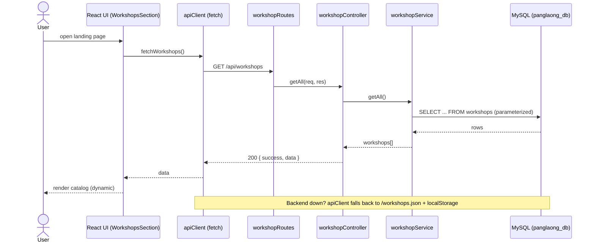
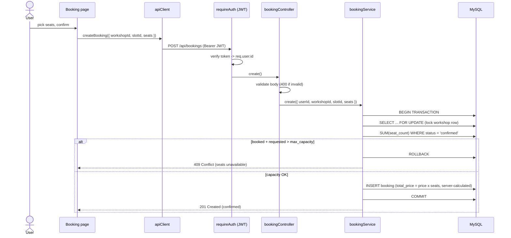

# 960121 Mini Project — แป้งละออง (Pang-La-Ong)

A **Smart-Niche Marketplace** for the *Skill-Share Workshop* niche — booking seats for
artisan baking classes. Full-stack: React + Vite frontend, Node.js + Express backend
(Controller-Route-Service), MySQL persistence, JWT + bcrypt auth.

> **Niche twist (capacity logic):** every class has a `max_capacity`. At checkout the
> server runs a transactional capacity check (`SELECT … FOR UPDATE`) and rejects an
> over-booking with **409 Conflict** — never trusting the client.

## Architecture

```
src/                       React + Vite frontend (@ → src/)
  components/ pages/ contexts/ api/   dynamic catalog, filters, booking, auth
backend/
  server.js                entry — env validation, middleware, routes
  config/db.js             MySQL connection pool (mysql2/promise)
  routes/ controllers/ services/   Controller-Route-Service (Separation of Concerns)
  middleware/              requireAuth (JWT) + global errorHandler
  schema.sql  seed.sql     relational schema (PK/FK/constraints) + sample data
```

## Database note (MySQL, not SQLite)

This project uses **MySQL / MariaDB** (server-based) rather than SQLite. The connection is
fully config-driven via `.env`, so switching databases is a config change, not a code change.
Because there is no `*.db` file, there is no database file to leak into Git — the
relevant "Storage Gatekeeper" concern is satisfied by design.

**Team standard: XAMPP (MariaDB) on macOS.** The default `.env.example` connects via XAMPP's
Unix socket (`/Applications/XAMPP/xamppfiles/var/mysql/mysql.sock`). `config/db.js` prefers
`DB_SOCKET` when set; if you run a different stack, see the alternatives in `.env.example`.

## Setup

### 1. Frontend

```bash
npm install
npm run dev      # http://localhost:5173 (proxies /api → http://localhost:3000)
npm run build    # production bundle
```

### 2. Backend

```bash
cd backend
npm install
cp .env.example .env       # defaults to XAMPP; set DB_PASS to your DB root password
```

**Start XAMPP first:** open the XAMPP Manager app and start **MySQL Database** (or run
`sudo /Applications/XAMPP/xamppfiles/xampp startmysql`) so the socket is available.

Initialize the database in one step — `init-db` creates the database (if missing)
and loads `schema.sql` + `seed.sql` using the values from your `.env`:

```bash
npm run init-db
```

> Prefer to do it by hand? The equivalent manual steps are:
> ```bash
> mysql -u root -p -e "CREATE DATABASE panglaong_db CHARACTER SET utf8mb4;"
> mysql -u root -p panglaong_db < schema.sql
> mysql -u root -p panglaong_db < seed.sql
> ```

Start the API (must be running on port 3000 for the frontend to load data):

```bash
npm start          # node server.js → http://localhost:3000
# npm run dev      # auto-restart on changes (nodemon)
# npm run start:prod  # build the frontend and serve it from Express
```

### Required environment variables (`backend/.env`)

| Variable | Purpose | Example |
|----------|---------|---------|
| `JWT_SECRET` | Signing secret for JWT (keep private) | `a-long-random-string` |
| `JWT_EXPIRES_IN` | Token lifetime | `24h` |
| `DB_USER` | DB user | `root` |
| `DB_PASS` | DB password | your DB root password |
| `DB_NAME` | Database name | `panglaong_db` |
| `DB_SOCKET` | Unix socket (**team standard**; takes priority when set) | `/Applications/XAMPP/xamppfiles/var/mysql/mysql.sock` |
| `DB_HOST` / `DB_PORT` | TCP fallback (Linux/prod, or leave `DB_SOCKET` unset) | `127.0.0.1` / `3306` |
| `PORT` | API port | `3000` |

The server **fails fast on startup** with a clear message if any required variable is
missing — copy `.env.example` and fill it in before running.

## Go-Live notes

- Secrets live only in `backend/.env` (gitignored); `backend/.env.example` is the tracked
  template.
- Errors: full detail is logged server-side; clients get a generic `500` in production.
- Requests are capped at `10kb`; all SQL uses parameterized queries.

## Sequence diagrams (UML)

The two core request round-trips. Both follow the **Route → Controller → Service** separation
of concerns, and the UI is rendered dynamically from the API (content separated from container).

### 1. `GET /api/workshops` — the catalog round-trip



### 2. `POST /api/bookings` — the booking gatekeeper (capacity → 409)



## Rubric coverage (960121 Mini-Project)

### Base requirements (must-haves)
- **Dynamic catalog** — `WorkshopsSection.jsx` renders from `GET /api/workshops`
- **Filtering (keyword / price / category)** — debounced search + price ranges + category chips in `WorkshopsSection.jsx`
- **Register / Login** — `controllers/authController.js` + `services/authService.js`
- **Booking** — `pages/Booking.jsx` seat picker → `POST /api/bookings`
- **Order, payment bypassed** — booking creates a confirmed order; no payment step

### Niche — "Skill-Share Workshop" (capacity / seat logic)
`services/bookingService.js → create()`: transaction + `SELECT … FOR UPDATE`, rejects
overbooking with **409 Conflict** (server re-checks `current_bookings < max_capacity`).

### 1–3 scoring categories
| # | Category | Where it lives |
|---|----------|----------------|
| 1 | Version Control | conventional commits (`feat:`/`fix:`/`chore:`) in git history |
| 2 | Data Flow (Content/UI) | UI rendered from API — `api/apiClient.js`, `components/WorkshopsSection.jsx` |
| 3 | Interaction | debounce — `hooks/useDebounce.js`; React event handling |
| 4 | State & Continuity | `lib/AuthContext.jsx` + `localStorage`; offline fallback in `api/apiClient.js` |
| 5 | Security — Auth | `services/authService.js` (bcrypt, JWT, user-enumeration safe) |
| 6 | Security — Gatekeeper | server-side price/capacity + input validation — `services/bookingService.js`, controllers |
| 7 | Persistence | `backend/schema.sql` — PK/FK, constraints, normalized tables |
| 8 | SQL Safety | parameterized queries (`?` placeholders) throughout services |
| 9 | Structure (C-R-S) | `backend/routes/` → `controllers/` → `services/` |
| 10 | Deployment | env validation (`server.js`), helmet/CSP, self-serving build, `DEPLOY.md` |

### Bonus
- **A — Stock-Check / Concurrency (3 pts):** the `SELECT … FOR UPDATE` transactional capacity
  check in `services/bookingService.js` is exactly this pattern.
